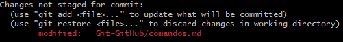
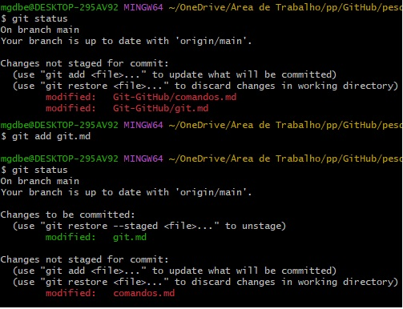
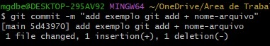
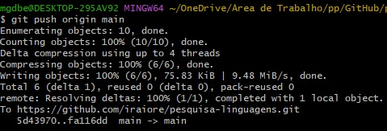
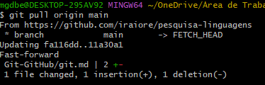
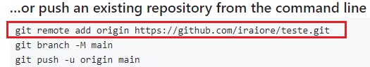
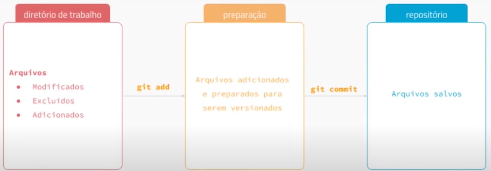

# Comandos do Git

Os comandos a seguir são executados no terminal do Git - **Git Bash**. Existem outros comandos, como as variações de commit edição de commit. Mas, por enquanto estou aprendendo somente os comandos básicos para se criar um repositório _on-line_ e conectá-lo como o repositório remoto

## Tabela de comandos
Comando | observação | Exemplo
---|---|---
git clone| cria um repositório do GitHub na maquina que está sendo executada o comando - **git clone + "nome-repositório"**|`git clone https://github.com/iraiore/pesquisa-linguagens.git`
git status | executando o comando é possível ver se há alterações no repositório clonado. Arquivos que novos e/ou alterados vão apaerecer na tela do termina. O comando deve ser executado dentro do repositório que houve as mudanças| `git status` Resultado do comando executado: 
git add| Neste comando deve-se adicionar o nome do arquivo ou diretório que deseja passa para a área de preparação para serem comitados posteriormente. O comando `git add .` não especifica nenhum arquivo, colocando todos os arquivos que tiveram alteração na áre de preparação|`git add`; Resultado de quando utiliza o comando especificando o arquivo:
git commit -m "mensagem"| Comando para salvar os arquivos no repositório local. Esta versão server para colocar uma mensagem no commit. A mensagem vai dentre das aspas.|` git commit -m "add exemplo git add + nome-arquivo"`. Resultado do comando: 
git push origin main| Comando para transferir os arquivos do repositório remoto para o repositório do GitHub. _origin main_ server para especificar para qual _branch_ o arquivo esta sendo upado|`git push origin main`. Resultado do comando: 
git pull orign main|Comando para trazer as modificações do repositório do GitHub para o repositório remoto| `git pull origin main`. Resultado da execução do código 
git remote add origin|Comando para conectar o repositório local com o repositório do GitHub. Qaundo se cria um repositório no GitHub, este comando aparece como sugestão|`git remote add origin https://github.com/iraiore/teste.git `. Recorte da pagina do GitHub: 
git branch|Verifica quantas branch o repositório possui|add exemplo
git checkout|add exemplo|add exemplo
***   
# Criando o repositório no GitHub e clonando no pc
1. Criar um repositório no GitHub;
1. Copiar o endereço do repositório do GitHub criado;
1. Criar ou selecionar a pasta que será utilizada para clonar o repositório;
1. Dentro da pasta, com o botão direito, escolher a opção  git bash here. Será aberto o terminal do Git ja dentro da pasta;
1. Executar o comando git clone;
1. Dentro da pasta será criado uma pasta (clonado) com o mesmo nome do repositório criado no GitHub;
1. Dentro da pasta aparecerá os arquivos que estavam dentro do repositório do GitHub. Nesta pasta também existe uma pasta com o nome .git (caso não esteja aparecendo é necessário setar a opção "exibir itens ocultos - Exibir -> Itens ocultos"). Esta pasta, neste formato, jindica que a pasta é um repositório git;
1. **Comitando um arquivo**
   1. Criar ou salvar um arquivo dentro da pasta criada (repositório clonado);
   1. No Git Bash executar o comando git status;
      1. Um parêntese para uma explanação sobre o **commit**:
      1. A pasta ou arquivo criado/modificado na pasta (repositório clonado) na máquina (repositório remoto) são os arquivos do estagio em vermelho;
      1. Ao executar o comando  git add,esses arquivos vao para a área de preparação ou _index_ (aindanão foram para o GitHub), somente quando o arquivo está no _index_ que eless estão prontos para serem versionados (commit);
      1. Após executar o comando  git add pode ser executado o git commit para salvar os aqruivos no repositório. Nesta etapa o arquivo está salvo e é permitido fazer regressões ou adiantar versões ou ramificações;
   1. Utilizar o comando  git add para mandar os arquivos para área de _index_. Para mandar apenas um arquivo (selecionar um arquivo específico dentre todos que foram alterados ou criados) utilizar o comando `git add nomeArquivo.txt`. Para mandar todos os arquivos (novos e/ou que foram alterados) executar o comando `git add .`
   1. Para passar o(s) arquivo(s) da área de preparação para área de versionamento, executar o comando git commit. Para inserir um commit com mensagem utilizar `git commit -m "mensagem do commit"`. O -m do comando possibilita introduzir uma mensagem ao realizar um commit;
1. O arquivo não aparecerá no GitHub ainda, é necessário executar o comando git push. Executar o comando`git push origin main` garente que o commit será feito na _branch main_        
      
      